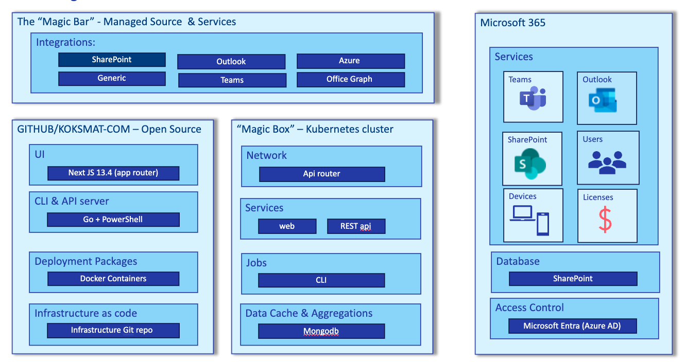

This repository contains the scripts need to create the MagicBox on Azure

# What is in the MagicBox?

## API Gateway

API router based on APISIX 

## MongoDB instances

MongoDB is managed by the Percona Operator and is namespace to the `percona´ namespace

## Web App 

## Web API

## Timer Jobs

